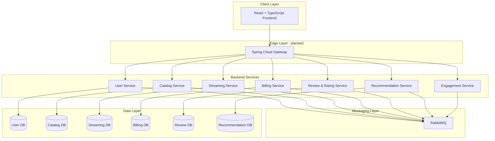

# DLS Exam — Project Runbook

This document is the operational reference for how the entire monorepo is **designed to run** and what is **implemented today**. Use it when onboarding, implementing new services, or wiring local/staging environments.

Sources of truth:

- `docs/Large Systems - Architecture & Stack docs.md`
- `docs/Large Systems - Architecture & Stack docs2.md`
- `docs/roadmap.md`
- Per-service `README.md` and `ARCHITECTURE_OVERVIEW.md` (where present)

---

## 1. System purpose

A streaming platform built as a **microservices monorepo**. Seven backend services collaborate through REST/GraphQL APIs and RabbitMQ events. Each service owns its data and deploys independently.



---

## 2. Implementation status (current)

| Layer / Service | Status | Notes |
|-----------------|--------|-------|
| `user-service` | Implemented | JWT auth, Flyway schema, demo user seed, RabbitMQ events |
| `billing-service` | Implemented | Plans, subscriptions, payments, invoices, saga activation |
| `streaming-service` | Implemented | Playback sessions, progress, subscription gate, DRM sim |
| `catalog-service` | Implemented | GraphQL browse/search, seeded catalog, review event consumer |
| `review-rating-service` | Implemented | REST ratings/reviews, Flyway + seeds, RabbitMQ publisher |
| `recommendation-service` | Implemented | Python/FastAPI, Scikit-learn NMF, RabbitMQ consumer, trending API |
| `engagement-service` | Implemented | REST notifications, domain-event consumers, MailHog email |
| `frontend/` | Implemented | React + TypeScript test UI (Stream Console) |
| `infra/docker` | Implemented | Unified compose: 7 services + frontend + RabbitMQ + MailHog + MySQL |
| `infra/k8s` | Implemented (local) | `dls-local.yaml` + `build-images.ps1` for Minikube/Docker Desktop |
| `infra/messaging` | Implemented | `TOPOLOGY.md`, `definitions.json`, broker import docs |
| `infra/observability` | Implemented | Prometheus, Grafana, Loki, Promtail, Zipkin (optional compose overlay) |
| `infra/ci-cd` | Scaffold only | GitHub Actions planned |
| `packages/contracts` | Implemented | Consolidated AsyncAPI (`dls-platform-events.yaml`) + JSON event schemas |
| API Gateway | Not started | Spring Cloud Gateway planned; frontend/nginx proxy used today |

---

## 3. Service catalog

### 3.1 User Management Service

| Item | Value |
|------|-------|
| Path | `services/user-service` |
| Port | `8081` |
| Database | MySQL `user_db` on host `3306` |
| RabbitMQ | `5672` / UI `15672` |
| Exchange | `user.events` |
| API style | REST |
| Auth | Issues JWT; owns credentials |

**Key endpoints**

- `POST /api/v1/auth/register`
- `POST /api/v1/auth/login`
- `GET /api/v1/auth/me`

**Events produced**

- `user.registered`
- `user.suspended`
- `user.deleted`

**Run**

```bash
cd services/user-service
docker compose up --build
# or: mvn spring-boot:run
```

---

### 3.2 Billing / Payment Service

| Item | Value |
|------|-------|
| Path | `services/billing-service` |
| Port | `8084` |
| Database | MySQL `billing_db` on host `3307` |
| RabbitMQ | `5672` / UI `15672` (shared) |
| Exchange | `billing.events` |
| API style | REST |
| Auth | Validates JWT from User Service |

**Key endpoints**

- `GET /api/v1/plans`
- `POST /api/v1/subscriptions` (requires `Idempotency-Key`)
- `GET /api/v1/subscriptions/active/{userId}` (public — used by Streaming)
- `POST /api/v1/payments`
- `GET /api/v1/invoices`

**Events produced**

- `subscription.activated`
- `subscription.cancelled`
- `payment.succeeded`
- `payment.failed`

**Run**

```bash
cd services/billing-service
docker compose up --build
```

---

### 3.3 Streaming / Playback Service

| Item | Value |
|------|-------|
| Path | `services/streaming-service` |
| Port | `8083` |
| Database | MySQL `streaming_db` on host `3308` |
| RabbitMQ | `5672` / UI `15672` (shared) |
| Exchange | `streaming.events` |
| API style | REST (command-based / CQRS) |
| Auth | Validates JWT from User Service |
| Depends on | Billing Service for subscription check |

**Key endpoints**

- `POST /api/v1/playback/start` (requires `Idempotency-Key`)
- `POST /api/v1/playback/sessions/{id}/stop`
- `POST /api/v1/playback/sessions/{id}/resume`
- `PUT /api/v1/playback/sessions/{id}/progress`
- `GET /api/v1/playback/sessions/me`

**Events produced**

- `playback.started`
- `playback.stopped`
- `playback.progress.updated`

**Run**

```bash
cd services/streaming-service
docker compose up --build
# Billing must be reachable at BILLING_SERVICE_BASE_URL (default http://localhost:8084)
```

---

### 3.4 Catalog Service

| Item | Value |
|------|-------|
| Path | `services/catalog-service` |
| Port | `8082` |
| Database | MySQL `catalog_db` on host `3310` |
| API style | GraphQL |
| Data | Content metadata, availability, search indexes (Flyway seed: 3 titles) |

**Events:** produces `content.created/updated/removed`; consumes `content.rated`, `content.reviewed`.

---

### 3.5 Review & Rating Service

| Item | Value |
|------|-------|
| Path | `services/review-rating-service` |
| Port | `8085` |
| Database | MySQL `review_db` on host `3311` |
| API style | REST |
| AsyncAPI stub | `services/review-rating-service/api/asyncapi.yaml` |
| Metrics | `GET /actuator/prometheus` |

**Events produced:** `content.rated`, `content.reviewed` on exchange `review.events`.

---

### 3.6 Recommendation Service

| Item | Value |
|------|-------|
| Path | `services/recommendation-service` |
| Stack | Python 3.12 + FastAPI + Scikit-learn + Pandas + NumPy |
| Port | `8090` |
| Database | MySQL `recommendation_db` on host `3309` |
| RabbitMQ | `5672` / UI `15672` (shared) |
| API style | REST (query-based recommendations) |
| Auth | JWT for personalized endpoint |

**Consumes (RabbitMQ):**
- `playback.started`, `playback.progress.updated`, `playback.stopped` from `streaming.events`
- `subscription.activated` from `billing.events`
- `content.rated` from `review.events`

**REST endpoints:**
- `GET /api/v1/recommendations/me` — personalized list (JWT)
- `GET /api/v1/recommendations/trending` — trending rankings
- `POST /api/v1/recommendations/retrain` — manual model retrain
- `POST /api/v1/recommendations/interactions` — dev/test ingest

**ML pipeline:**
- interaction weights aggregated from events
- Scikit-learn NMF collaborative filtering
- precomputed lists stored per user
- periodic retraining via APScheduler

**Run:**

```bash
cd services/recommendation-service
docker compose up --build
```

---

### 3.7 Engagement Service

| Item | Value |
|------|-------|
| Path | `services/engagement-service` |
| Port | `8086` |
| Database | MySQL `engagement_db` on host `3312` |
| Style | Async-first (RabbitMQ consumers) + REST for manual triggers |
| Mail | MailHog in local compose (`8025` UI, SMTP `1025`) |
| AsyncAPI stub | `services/engagement-service/api/asyncapi.yaml` |
| Metrics | `GET /actuator/prometheus` |

**Consumes:** `subscription.activated`, `playback.stopped`, `content.created`, `content.reviewed` (plus internal `notification-queue`).  
**Delivers:** email notifications via Thymeleaf templates.

Scaling with KEDA ScaledJob in Kubernetes is planned for production-style deployments.

---

## 4. Port and infrastructure map (local dev)

| Component | Host port | Container / service |
|-----------|-----------|---------------------|
| **Frontend (test UI)** | **3000** | `dls-frontend` |
| User Service | 8081 | `user-service` |
| Catalog Service | 8082 | `catalog-service` |
| Streaming Service | 8083 | `streaming-service` |
| Billing Service | 8084 | `billing-service` |
| Review Service | 8085 | `review-rating-service` |
| Engagement Service | 8086 | `engagement-service` |
| Recommendation Service | 8090 | `recommendation-service` |
| RabbitMQ | `5672` / UI `15672` | `dls-rabbitmq` (shared) |
| MailHog | SMTP `1025` / UI `8025` | `mailhog` |
| Grafana | 3001 | `grafana` (observability overlay; `admin` / `admin`) |
| Prometheus | 9090 | `prometheus` |
| Zipkin | 9411 | `zipkin` |
| Loki | 3100 | `loki` (query via Grafana Explore) |

| MySQL database | Host port |
|----------------|-----------|
| `user_db` | 3306 |
| `billing_db` | 3307 |
| `streaming_db` | 3308 |
| `recommendation_db` | 3309 |
| `catalog_db` | 3310 |
| `review_db` | 3311 |
| `engagement_db` | 3312 |

The platform uses **one shared RabbitMQ**, **MailHog**, and **database-per-service MySQL 8.4** instances on the **`dls-platform` Docker network**. Run everything from the repo root:

```bash
docker compose -f infra/docker/docker-compose.yml up --build
```

**With observability** (metrics, logs, traces):

```bash
docker compose \
  -f infra/docker/docker-compose.yml \
  -f infra/observability/docker-compose.yml \
  up --build -d
```

Start the main platform first if observability was brought up alone — Java services must join `dls-platform` before Prometheus can scrape them.

Open **http://localhost:3000** for the Stream Console test UI.

**Network troubleshooting:** if services fail with `UnknownHostException` for `user-service-db` or similar, old containers may be on a different network. Run `docker compose -f infra/docker/docker-compose.yml down` then `up --build` again. See `infra/docker/README.md`.

Per-service `docker-compose.yml` files include the shared compose definition for convenience.

### 4.1 Database seeds (automatic on first startup)

| Service | Mechanism | Seed data |
|---------|-----------|-----------|
| `user-service` | Flyway `V2__seed_demo_user.sql` | `demo@dls.local` / `password123` (id `dddddddd-dddd-dddd-dddd-ddddddddddd1`) |
| `billing-service` | Flyway `V2__seed_subscription_plans.sql` | BASIC, PREMIUM, FAMILY plan UUIDs |
| `catalog-service` | Flyway `V2` + `V3` | 10 movies/shows (`aaaaaaaa-aaaa-aaaa-aaaa-aaaaaaaaaaa1`–`aaa10`), 6 genres |
| `review-rating-service` | Flyway `V2__seed_reviews.sql` | Sample ratings/reviews aligned to demo user + catalog IDs |
| `streaming-service` | Flyway schema only | No content seed |
| `recommendation-service` | `schema.sql` on first boot | No interaction seed (populated via events or REST ingest) |
| `engagement-service` | JPA `ddl-auto: update` | No seed |

Flyway migrations run when each Java service starts against an empty database volume. Re-seeding requires `docker compose down -v` or a fresh volume.

### 4.2 Kubernetes (local)

```powershell
.\infra\k8s\build-images.ps1          # or -LoadToMinikube
kubectl apply -f infra/k8s/dls-local.yaml
kubectl get pods -w
kubectl get svc
```

See `infra/k8s/README.md` for NodePort access and MailHog port-forward.

---

## 5. Authentication flow

1. Client registers/logs in via **User Service** → receives JWT (`Bearer` token).
2. JWT contains `sub` (email), `uid` (user UUID), `roles`.
3. All protected backend services validate the same JWT secret (`JWT_SECRET_BASE64`).
4. **Planned:** API Gateway validates JWT once at the edge and forwards identity headers.

Shared dev secret (all services): see each service `config/.env.example`.

---

## 6. Event-driven communication

**Primary pattern:** services publish domain events to RabbitMQ topic exchanges. Consumers react asynchronously (Recommendation, Engagement, future Analytics).

| Producer | Events |
|----------|--------|
| User Service | `user.registered`, `user.suspended`, `user.deleted` |
| Billing Service | `subscription.activated`, `subscription.cancelled`, `payment.succeeded`, `payment.failed` |
| Streaming Service | `playback.started`, `playback.stopped`, `playback.progress.updated` |
| Catalog Service | `content.created`, `content.updated`, `content.removed` |
| Review Service | `content.rated`, `content.reviewed`, `review.moderated` (moderated planned) |

**Consumers today:** Recommendation (playback, billing, review), Catalog (review), Engagement (`subscription.activated`, `playback.stopped`, `content.created`, `content.reviewed`).

**Exception (synchronous read):** Streaming calls Billing `GET /subscriptions/active/{userId}` before playback. This is an intentional gate, not primary inter-service communication.

**Event contracts**

| Artifact | Location |
|----------|----------|
| Canonical AsyncAPI (all events) | `packages/contracts/asyncapi/dls-platform-events.yaml` |
| JSON Schema payloads | `packages/contracts/schemas/events.json` |
| Human-readable topology | `infra/messaging/TOPOLOGY.md` |
| Broker import (optional) | `infra/messaging/definitions.json` |
| Per-service stubs | `services/*/api/asyncapi.yaml` |

Services declare exchanges/queues at startup via Spring `RabbitAdmin` or the Python consumer; importing `definitions.json` is optional for local dev.

---

## 7. End-to-end happy path

**Quickest path:** `docker compose -f infra/docker/docker-compose.yml up --build` → open http://localhost:3000 → sign in as `demo@dls.local` / `password123` → Overview → **Run demo flow**.

Manual API sequence (all services running):

```text
1. Login (or register)
   POST http://localhost:8081/api/v1/auth/login
   Body: { "email": "demo@dls.local", "password": "password123" }
   → save JWT from response

2. Activate subscription
   POST http://localhost:8084/api/v1/subscriptions
   Header: Authorization: Bearer <jwt>
   Header: Idempotency-Key: sub-activate-001
   Body: { "planId": "11111111-1111-1111-1111-111111111101" }

3. Start playback
   POST http://localhost:8083/api/v1/playback/start
   Header: Authorization: Bearer <jwt>
   Header: Idempotency-Key: playback-001
   Body: { "contentId": "aaaaaaaa-aaaa-aaaa-aaaa-aaaaaaaaaaa1" }

4. Update progress
   PUT http://localhost:8083/api/v1/playback/sessions/{sessionId}/progress
   Header: Authorization: Bearer <jwt>
   Body: { "positionSeconds": 120 }

5. Stop playback
   POST http://localhost:8083/api/v1/playback/sessions/{sessionId}/stop
   Header: Authorization: Bearer <jwt>
```

Check RabbitMQ management UI (`15672`) and MailHog (`8025`) for async side effects.

**With observability running:** after the demo flow, open Grafana (`http://localhost:3001`) → Explore → Loki → `{compose_service="frontend"}` to see request logs, or Zipkin (`http://localhost:9411`) to inspect cross-service traces.

---

## 8. Repository layers

### 8.1 `services/*` — microservices

Standard layout per service:

```text
services/<name>/
  src/           # application code
  test/          # tests
  api/           # OpenAPI / GraphQL / AsyncAPI contracts
  config/        # .env.example templates
  pom.xml        # Java services (Maven)
  Dockerfile
  docker-compose.yml
  README.md
```

### 8.2 `frontend/` — Stream Console test UI

React + TypeScript + Vite. Proxies `/api/{service}/...` to backend ports (nginx in Docker, Vite dev server locally). Not a production product UI — health checks and guided cross-service demo flow.

### 8.3 `infra/` — platform operations

| Folder | Purpose |
|--------|---------|
| `infra/docker` | Full-stack local compose, shared networks |
| `infra/k8s` | Minikube/k3s manifests, KEDA ScaledJob for Engagement |
| `infra/messaging` | RabbitMQ topology (`TOPOLOGY.md`), broker `definitions.json` |
| `infra/observability` | Prometheus, Grafana, Loki, Promtail, Zipkin compose overlay |
| `infra/ci-cd` | GitHub Actions pipelines |
| `infra/security` | Policies, secrets templates |

### 8.4 `packages/` — shared artifacts

| Folder | Purpose |
|--------|---------|
| `packages/contracts` | Consolidated AsyncAPI + JSON Schema for platform events |
| `packages/shared-types` | Shared DTOs |
| `packages/shared-utils` | Reusable helpers |

### 8.5 `docs/` — architecture and planning

| File | Purpose |
|------|---------|
| `Large Systems - Architecture & Stack docs.md` | Full assignment spec |
| `Large Systems - Architecture & Stack docs2.md` | Microservice responsibilities matrix |
| `roadmap.md` | Phased delivery plan |
| `PROJECT_RUNBOOK.md` | This file — how to run everything |

### 8.6 Root build

Aggregator Maven POM at repo root registers Java modules:

```bash
# from repo root
mvn test                              # all Java services
mvn test -pl services/streaming-service
mvn test -pl services/billing-service
mvn test -pl services/user-service
```

Open the **repo root** in the IDE (not a single service folder) so Java language support works.

---

## 9. Observability

### 9.1 Per-service instrumentation

| Service | Health | Metrics | Tracing |
|---------|--------|---------|---------|
| Java services (all six) | `GET /actuator/health` | `GET /actuator/prometheus` | Micrometer Tracing → Zipkin |
| recommendation-service | `GET /health` | `GET /metrics` | — |

Parent POM and service `application.yml` configure Micrometer Prometheus registry and Zipkin export. Main compose injects:

- `ZIPKIN_ENDPOINT=http://zipkin:9411/api/v2/spans`
- `TRACING_SAMPLE_PROBABILITY=1.0` (local dev; reduce in production)

`/actuator/prometheus` is permitted without JWT on User, Billing, and Streaming security configs (and equivalent on other Java services).

Swagger UI: `GET /swagger-ui.html` (Java REST services).

### 9.2 Central stack (`infra/observability/`)

| Tool | URL | Role |
|------|-----|------|
| Grafana | http://localhost:3001 | Dashboards (`admin` / `admin`) |
| Prometheus | http://localhost:9090 | Scrapes all service metrics |
| Loki | http://localhost:3100 | Log store (query in Grafana) |
| Zipkin | http://localhost:9411 | Distributed traces |
| Promtail | — | Ships container stdout → Loki via Docker socket |

Grafana datasources (Prometheus, Loki, Zipkin) are auto-provisioned from `infra/observability/grafana/provisioning/`.

**Start observability only** (platform must already be running):

```bash
docker compose -f infra/observability/docker-compose.yml up -d
```

**Quick checks**

1. Prometheus → **Status → Targets** — all `*-service` jobs should be `UP`.
2. Grafana → **Explore → Prometheus** — e.g. `rate(http_server_requests_seconds_count[5m])`.
3. Grafana → **Explore → Loki** — e.g. `{compose_service="frontend"}` for nginx access logs, or `{compose_service="streaming-service"}`.
4. Zipkin — search traces after a few API calls through the frontend or Postman.

See `infra/observability/README.md` for config file paths.

---

## 10. CI/CD (planned)

Pipeline stages per assignment:

1. Compile / build (Maven, npm, pip)
2. Unit tests
3. Static analysis (SonarCloud/SpotBugs, ESLint, Bandit)
4. Integration tests (Testcontainers)
5. Docker image build + push (Docker Hub / Artifact Registry)
6. Deploy to local K8s or cloud

Definitions will live in `infra/ci-cd/` and `.github/workflows/`.

---

## 11. Cloud / Kubernetes

**Local Kubernetes** is implemented under `infra/k8s/` (`dls-local.yaml`, `build-images.ps1`). Use Docker Desktop Kubernetes or Minikube.

Assignment also describes (for report / future work):

- KEDA ScaledJob for Engagement Service
- Managed DB and K8s on cloud (GCP Cloud SQL + GKE or AWS RDS + EKS)

---

## 12. Design patterns in use

| Pattern | Where |
|---------|-------|
| Database-per-service | Each microservice owns its MySQL schema |
| Event-driven architecture | RabbitMQ primary inter-service communication |
| Saga | Billing subscription activation |
| Idempotency | Billing payments; Streaming session start |
| CQRS | Command-based Streaming; query-based Catalog/Recommendations (planned) |
| Immutable events | Playback events |
| API Gateway | Planned at edge |

---

## 13. Common operations

### Build all Java services

```bash
mvn test
```

### Run one service locally (example)

```bash
cd services/streaming-service
cp config/.env.example config/.env   # optional
mvn spring-boot:run
```

### Run one service with Docker

```bash
cd services/<service>
docker compose up --build
```

### IDE: fix "non-project file" warnings

1. Open workspace at repo root (`DLS_Exam`)
2. `Ctrl+Shift+P` → **Java: Clean Java Language Server Workspace**
3. Reload window

### Git: ignore build output

`**/target/` is in root `.gitignore` (Maven build artifacts).

---

## 14. What to implement next (suggested order)

1. ~~Unified docker compose (all services + frontend)~~ (done)
2. ~~Catalog, Review, Engagement, Recommendation wiring~~ (done)
3. ~~Local K8s manifests~~ (done)
4. ~~`packages/contracts` — shared AsyncAPI + JSON event schemas~~ (done)
5. ~~`infra/observability` — Prometheus, Grafana, Loki, Zipkin~~ (done)
6. ~~`infra/messaging` — documented topology + broker definitions~~ (done)
7. API Gateway — single frontend entry point
8. `infra/ci-cd` — GitHub Actions pipelines
9. Engagement KEDA ScaledJob + K8s probes/PVCs for databases
10. Full Google OAuth callback flow
11. `infra/security` — policies and secrets templates

---

## 15. Quick reference — who calls whom

| Caller | callee | Mechanism | Why |
|--------|--------|-----------|-----|
| Frontend | All services | REST/GraphQL via nginx/Vite proxy | User actions and demo flow |
| Streaming | Billing | REST `GET /subscriptions/active/{userId}` | Subscription gate before playback |
| Recommendation | Event bus | RabbitMQ consume | Build preference models and trending rankings |
| Engagement | Event bus | RabbitMQ consume | Notifications |
| Catalog | Event bus | RabbitMQ consume/produce | Metadata sync |

**Rule:** no service reads another service's database directly.

---

*Last updated: observability stack (Prometheus/Grafana/Loki/Zipkin), shared event contracts, RabbitMQ topology docs, Micrometer instrumentation on all services, `dls-platform` Docker network.*
