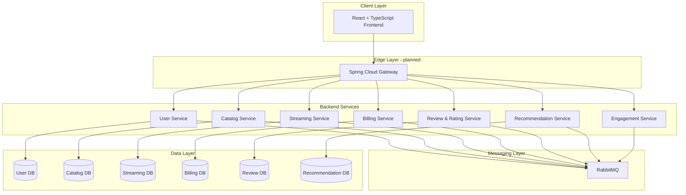

# DLS Exam — Project Runbook

This document is the operational reference for how the entire monorepo is **designed to run** and what is **implemented today**. Use it when onboarding, implementing new services, or wiring local/staging environments.

Sources of truth:

- `docs/Large Systems - Architecture & Stack docs.md`
- `docs/Large Systems - Architecture & Stack docs2.md`
- `docs/roadmap.md`
- Per-service `README.md` and `ARCHITECTURE_OVERVIEW.md` (where present)

---

## 1. System purpose

A streaming platform built as a **microservices monorepo**. Seven backend services collaborate through REST/GraphQL APIs and RabbitMQ events. Each service owns its data and deploys independently.



---

## 2. Implementation status (current)

| Layer / Service | Status | Notes |
|-----------------|--------|-------|
| `user-service` | Implemented | JWT auth, account lifecycle, RabbitMQ events |
| `billing-service` | Implemented | Plans, subscriptions, payments, invoices, saga activation |
| `streaming-service` | Implemented | Playback sessions, progress, subscription gate, DRM sim |
| `catalog-service` | Scaffold only | GraphQL planned |
| `review-rating-service` | Scaffold only | REST planned |
| `recommendation-service` | Scaffold only | Python/FastAPI + ML planned |
| `engagement-service` | Scaffold only | Async/KEDA ScaledJob planned |
| `frontend/` | Scaffold only | React + TypeScript + Vite planned |
| `infra/docker` | Scaffold only | Per-service compose exists; root compose planned |
| `infra/k8s` | Scaffold only | Local K8s (Minikube/k3s) planned |
| `infra/messaging` | Scaffold only | Shared broker topology planned |
| `infra/observability` | Scaffold only | Prometheus/Grafana planned |
| `infra/ci-cd` | Scaffold only | GitHub Actions planned |
| `packages/contracts` | Scaffold only | Shared OpenAPI/AsyncAPI planned |
| API Gateway | Not started | Spring Cloud Gateway planned |

---

## 3. Service catalog

### 3.1 User Management Service

| Item | Value |
|------|-------|
| Path | `services/user-service` |
| Port | `8081` |
| Database | PostgreSQL `user_db` on host `5432` |
| RabbitMQ | `5672` / UI `15672` |
| Exchange | `user.events` |
| API style | REST |
| Auth | Issues JWT; owns credentials |

**Key endpoints**

- `POST /api/v1/auth/register`
- `POST /api/v1/auth/login`
- `GET /api/v1/auth/me`

**Events produced**

- `user.registered`
- `user.suspended`
- `user.deleted`

**Run**

```bash
cd services/user-service
docker compose up --build
# or: mvn spring-boot:run
```

---

### 3.2 Billing / Payment Service

| Item | Value |
|------|-------|
| Path | `services/billing-service` |
| Port | `8084` |
| Database | PostgreSQL `billing_db` on host `5433` |
| RabbitMQ | `5673` / UI `15673` |
| Exchange | `billing.events` |
| API style | REST |
| Auth | Validates JWT from User Service |

**Key endpoints**

- `GET /api/v1/plans`
- `POST /api/v1/subscriptions` (requires `Idempotency-Key`)
- `GET /api/v1/subscriptions/active/{userId}` (public — used by Streaming)
- `POST /api/v1/payments`
- `GET /api/v1/invoices`

**Events produced**

- `subscription.activated`
- `subscription.cancelled`
- `payment.succeeded`
- `payment.failed`

**Run**

```bash
cd services/billing-service
docker compose up --build
```

---

### 3.3 Streaming / Playback Service

| Item | Value |
|------|-------|
| Path | `services/streaming-service` |
| Port | `8083` |
| Database | PostgreSQL `streaming_db` on host `5434` |
| RabbitMQ | `5674` / UI `15674` |
| Exchange | `streaming.events` |
| API style | REST (command-based / CQRS) |
| Auth | Validates JWT from User Service |
| Depends on | Billing Service for subscription check |

**Key endpoints**

- `POST /api/v1/playback/start` (requires `Idempotency-Key`)
- `POST /api/v1/playback/sessions/{id}/stop`
- `POST /api/v1/playback/sessions/{id}/resume`
- `PUT /api/v1/playback/sessions/{id}/progress`
- `GET /api/v1/playback/sessions/me`

**Events produced**

- `playback.started`
- `playback.stopped`
- `playback.progress.updated`

**Run**

```bash
cd services/streaming-service
docker compose up --build
# Billing must be reachable at BILLING_SERVICE_BASE_URL (default http://localhost:8084)
```

---

### 3.4 Catalog Service (planned)

| Item | Value |
|------|-------|
| Path | `services/catalog-service` |
| Port | TBD (suggest `8082`) |
| API style | GraphQL |
| Data | Content metadata, availability, search indexes |

**Events (planned):** `content.created`, `content.updated`, `content.removed`, consumes rating/review events.

---

### 3.5 Review & Rating Service (planned)

| Item | Value |
|------|-------|
| Path | `services/review-rating-service` |
| Port | TBD (suggest `8085`) |
| API style | REST |

**Events (planned):** `content.rated`, `content.reviewed`, `review.moderated`

---

### 3.6 Recommendation Service (planned)

| Item | Value |
|------|-------|
| Path | `services/recommendation-service` |
| Stack | Python + FastAPI + Scikit-learn |
| Port | TBD (suggest `8090`) |

**Consumes:** playback, rating, subscription events.  
**Produces:** recommendation lists, trending rankings.

---

### 3.7 Engagement Service (planned)

| Item | Value |
|------|-------|
| Path | `services/engagement-service` |
| Style | Async-first (RabbitMQ consumers), minimal REST |
| Scaling | KEDA ScaledJob in Kubernetes |

**Consumes:** `subscription.activated`, `playback.stopped`, `content.created`  
**Delivers:** email/push/in-app notifications, continue-watching reminders.

---

## 4. Port and infrastructure map (local dev)

| Component | Host port | Container / service |
|-----------|-----------|---------------------|
| User Service | 8081 | `user-service` |
| Catalog Service | 8082 (planned) | — |
| Streaming Service | 8083 | `streaming-service` |
| Billing Service | 8084 | `billing-service` |
| User DB | 5432 | `user-service-db` |
| Billing DB | 5433 | `billing-service-db` |
| Streaming DB | 5434 | `streaming-service-db` |
| User RabbitMQ | 5672 / 15672 | `user-service-rabbitmq` |
| Billing RabbitMQ | 5673 / 15673 | `billing-service-rabbitmq` |
| Streaming RabbitMQ | 5674 / 15674 | `streaming-service-rabbitmq` |

Each implemented service currently ships its **own** docker-compose stack (isolated DB + broker). A unified `infra/docker` compose is planned to run the full platform together with one command.

---

## 5. Authentication flow

1. Client registers/logs in via **User Service** → receives JWT (`Bearer` token).
2. JWT contains `sub` (email), `uid` (user UUID), `roles`.
3. All protected backend services validate the same JWT secret (`JWT_SECRET_BASE64`).
4. **Planned:** API Gateway validates JWT once at the edge and forwards identity headers.

Shared dev secret (all services): see each service `config/.env.example`.

---

## 6. Event-driven communication

**Primary pattern:** services publish domain events to RabbitMQ topic exchanges. Consumers react asynchronously (Recommendation, Engagement, future Analytics).

| Producer | Events |
|----------|--------|
| User Service | `user.registered`, `user.suspended`, `user.deleted` |
| Billing Service | `subscription.activated`, `subscription.cancelled`, `payment.succeeded`, `payment.failed` |
| Streaming Service | `playback.started`, `playback.stopped`, `playback.progress.updated` |
| Catalog Service | `content.created`, `content.updated`, `content.removed` |
| Review Service | `content.rated`, `content.reviewed`, `review.moderated` |

**Exception (synchronous read):** Streaming calls Billing `GET /subscriptions/active/{userId}` before playback. This is an intentional gate, not primary inter-service communication.

Event contracts (stubs): each service `api/asyncapi.yaml`. Shared contracts planned in `packages/contracts/`.

---

## 7. End-to-end happy path (implemented services)

Run User, Billing, and Streaming stacks (three terminals or future unified compose).

```text
1. Register user
   POST http://localhost:8081/api/v1/auth/register
   → save JWT from response

2. Activate subscription
   POST http://localhost:8084/api/v1/subscriptions
   Header: Authorization: Bearer <jwt>
   Header: Idempotency-Key: sub-activate-001
   Body: { "planId": "11111111-1111-1111-1111-111111111101" }

3. Start playback
   POST http://localhost:8083/api/v1/playback/start
   Header: Authorization: Bearer <jwt>
   Header: Idempotency-Key: playback-001
   Body: { "contentId": "22222222-2222-2222-2222-222222222201" }

4. Update progress
   PUT http://localhost:8083/api/v1/playback/sessions/{sessionId}/progress
   Header: Authorization: Bearer <jwt>
   Body: { "positionSeconds": 120 }

5. Stop playback
   POST http://localhost:8083/api/v1/playback/sessions/{sessionId}/stop
   Header: Authorization: Bearer <jwt>
```

Check RabbitMQ management UIs to confirm events on each broker.

---

## 8. Repository layers

### 8.1 `services/*` — microservices

Standard layout per service:

```text
services/<name>/
  src/           # application code
  test/          # tests
  api/           # OpenAPI / GraphQL / AsyncAPI contracts
  config/        # .env.example templates
  pom.xml        # Java services (Maven)
  Dockerfile
  docker-compose.yml
  README.md
```

### 8.2 `frontend/` — client app (planned)

React + TypeScript + Vite. Axios for REST, React Query for server state. Talks to API Gateway (planned) or services directly in early dev.

### 8.3 `infra/` — platform operations

| Folder | Purpose |
|--------|---------|
| `infra/docker` | Full-stack local compose, shared networks |
| `infra/k8s` | Minikube/k3s manifests, KEDA ScaledJob for Engagement |
| `infra/messaging` | Exchange/queue bindings, broker config |
| `infra/observability` | Prometheus, Grafana, log aggregation |
| `infra/ci-cd` | GitHub Actions pipelines |
| `infra/security` | Policies, secrets templates |

### 8.4 `packages/` — shared artifacts

| Folder | Purpose |
|--------|---------|
| `packages/contracts` | Cross-service API and event schemas |
| `packages/shared-types` | Shared DTOs |
| `packages/shared-utils` | Reusable helpers |

### 8.5 `docs/` — architecture and planning

| File | Purpose |
|------|---------|
| `Large Systems - Architecture & Stack docs.md` | Full assignment spec |
| `Large Systems - Architecture & Stack docs2.md` | Microservice responsibilities matrix |
| `roadmap.md` | Phased delivery plan |
| `PROJECT_RUNBOOK.md` | This file — how to run everything |

### 8.6 Root build

Aggregator Maven POM at repo root registers Java modules:

```bash
# from repo root
mvn test                              # all Java services
mvn test -pl services/streaming-service
mvn test -pl services/billing-service
mvn test -pl services/user-service
```

Open the **repo root** in the IDE (not a single service folder) so Java language support works.

---

## 9. Observability (per implemented service)

Each Spring Boot service exposes Actuator:

- `GET /actuator/health`
- `GET /actuator/prometheus`

Swagger UI: `GET /swagger-ui.html`

Centralized monitoring via `infra/observability` is planned (Prometheus scrape + Grafana dashboards).

---

## 10. CI/CD (planned)

Pipeline stages per assignment:

1. Compile / build (Maven, npm, pip)
2. Unit tests
3. Static analysis (SonarCloud/SpotBugs, ESLint, Bandit)
4. Integration tests (Testcontainers)
5. Docker image build + push (Docker Hub / Artifact Registry)
6. Deploy to local K8s or cloud

Definitions will live in `infra/ci-cd/` and `.github/workflows/`.

---

## 11. Cloud / Kubernetes (planned)

Assignment requires:

- Local Kubernetes (Minikube or k3s), not full cloud deployment
- KEDA ScaledJob for Engagement Service
- Managed DB and K8s described in report (GCP Cloud SQL + GKE or AWS RDS + EKS)

Manifests target: `infra/k8s/`.

---

## 12. Design patterns in use

| Pattern | Where |
|---------|-------|
| Database-per-service | Each microservice owns its PostgreSQL schema |
| Event-driven architecture | RabbitMQ primary inter-service communication |
| Saga | Billing subscription activation |
| Idempotency | Billing payments; Streaming session start |
| CQRS | Command-based Streaming; query-based Catalog/Recommendations (planned) |
| Immutable events | Playback events |
| API Gateway | Planned at edge |

---

## 13. Common operations

### Build all Java services

```bash
mvn test
```

### Run one service locally (example)

```bash
cd services/streaming-service
cp config/.env.example config/.env   # optional
mvn spring-boot:run
```

### Run one service with Docker

```bash
cd services/<service>
docker compose up --build
```

### IDE: fix "non-project file" warnings

1. Open workspace at repo root (`DLS_Exam`)
2. `Ctrl+Shift+P` → **Java: Clean Java Language Server Workspace**
3. Reload window

### Git: ignore build output

`**/target/` is in root `.gitignore` (Maven build artifacts).

---

## 14. What to implement next (suggested order)

1. `infra/docker` — unified compose wiring User + Billing + Streaming + shared RabbitMQ
2. `catalog-service` — GraphQL content API
3. API Gateway — single frontend entry point
4. `frontend/` — shell app consuming gateway
5. `review-rating-service`
6. `recommendation-service` (Python)
7. `engagement-service` + KEDA
8. `infra/k8s` + `infra/ci-cd` + `infra/observability`

---

## 15. Quick reference — who calls whom

| Caller | callee | Mechanism | Why |
|--------|--------|-----------|-----|
| Frontend | All services | REST/GraphQL via Gateway (planned) | User actions |
| Streaming | Billing | REST `GET /subscriptions/active/{userId}` | Subscription gate before playback |
| Recommendation | Event bus | RabbitMQ consume | Build preference models |
| Engagement | Event bus | RabbitMQ consume | Notifications |
| Catalog | Event bus | RabbitMQ consume/produce | Metadata sync |

**Rule:** no service reads another service's database directly.

---

*Last updated to reflect: user-service, billing-service, streaming-service implementations.*
