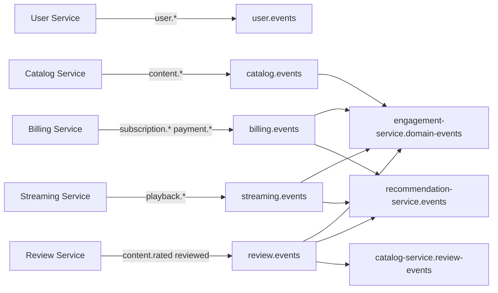

# RabbitMQ Event Topology

All inter-service communication uses **topic exchanges**. Routing keys use dot notation (`domain.action`).

## Exchanges

| Exchange | Type | Producers | Purpose |
|----------|------|-----------|---------|
| `user.events` | topic | User Service | Account lifecycle |
| `billing.events` | topic | Billing Service | Subscriptions and payments |
| `streaming.events` | topic | Streaming Service | Playback lifecycle |
| `catalog.events` | topic | Catalog Service | Content metadata changes |
| `review.events` | topic | Review & Rating Service | Ratings and written reviews |

## Queues and bindings

| Queue | Bound exchange | Routing key(s) | Consumer |
|-------|----------------|----------------|----------|
| `catalog-service.review-events` | `review.events` | `content.rated`, `content.reviewed` | Catalog Service |
| `engagement-service.domain-events` | `billing.events` | `subscription.activated` | Engagement Service |
| `engagement-service.domain-events` | `streaming.events` | `playback.stopped` | Engagement Service |
| `engagement-service.domain-events` | `catalog.events` | `content.created` | Engagement Service |
| `engagement-service.domain-events` | `review.events` | `content.reviewed` | Engagement Service |
| `notification-queue` | *(direct publish)* | — | Engagement Service (manual REST triggers) |
| `recommendation-service.events` | `streaming.events` | `playback.started`, `playback.progress.updated`, `playback.stopped` | Recommendation Service |
| `recommendation-service.events` | `billing.events` | `subscription.activated` | Recommendation Service |
| `recommendation-service.events` | `review.events` | `content.rated` | Recommendation Service |

## Event catalogue

### `user.events`

| Routing key | Producer | Payload highlights |
|-------------|----------|-------------------|
| `user.registered` | User | `userId`, `email`, `occurredAt` |
| `user.suspended` | User | `userId`, `email`, `reason`, `occurredAt` |
| `user.deleted` | User | `userId`, `email`, `occurredAt` |

### `billing.events`

| Routing key | Producer | Consumers |
|-------------|----------|-----------|
| `subscription.activated` | Billing | Engagement, Recommendation |
| `subscription.cancelled` | Billing | — |
| `payment.succeeded` | Billing | — |
| `payment.failed` | Billing | — |

### `streaming.events`

| Routing key | Producer | Consumers |
|-------------|----------|-----------|
| `playback.started` | Streaming | Recommendation |
| `playback.progress.updated` | Streaming | Recommendation |
| `playback.stopped` | Streaming | Engagement, Recommendation |

### `catalog.events`

| Routing key | Producer | Consumers |
|-------------|----------|-----------|
| `content.created` | Catalog | Engagement |
| `content.updated` | Catalog | — |
| `content.removed` | Catalog | — |

### `review.events`

| Routing key | Producer | Consumers |
|-------------|----------|-----------|
| `content.rated` | Review | Catalog, Recommendation |
| `content.reviewed` | Review | Catalog, Engagement |

## Synchronous exception

Streaming calls Billing `GET /api/v1/subscriptions/active/{userId}` before playback. This is an intentional subscription gate, not primary messaging.

## Diagram

## Adding a new event

1. Add payload schema to `packages/contracts/schemas/events.json`
2. Update `packages/contracts/asyncapi/dls-platform-events.yaml`
3. Declare exchange binding in the producing/consuming service
4. Update this file and `definitions.json`
